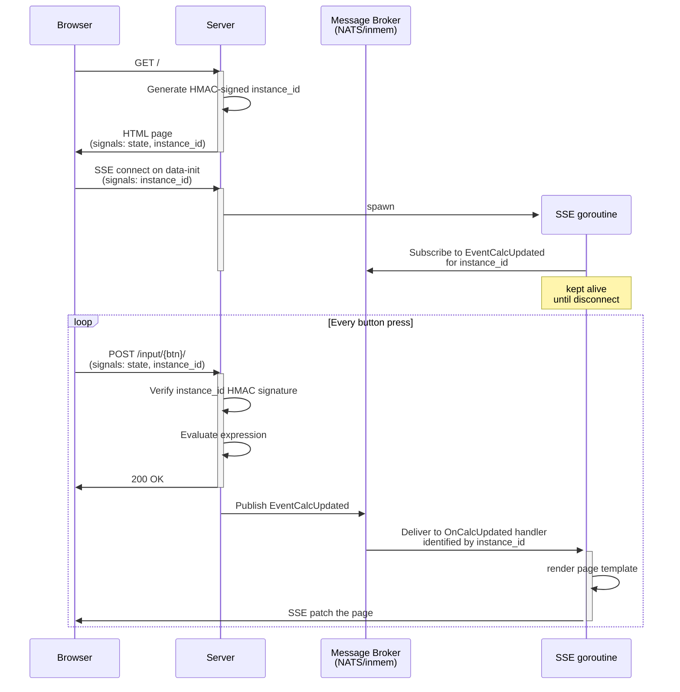

# Calculator

https://github.com/user-attachments/assets/3806da2c-c07f-4595-8329-334f8014a364

A basic calculator with server-side evaluation.
Demonstrates the
[fat-morph](https://data-star.dev/guide/the_tao_of_datastar#in-morph-we-trust)
pattern: the UI holds state in signals and sends commands to the server, which
evaluates and returns the updated page. Expression evaluation uses
arbitrary-precision decimal arithmetic (`github.com/shopspring/decimal`) to avoid
floating-point rounding. The calculator supports full keyboard input
(digits, operators, Enter, Escape, Backspace) and clipboard integration
(Cmd+C to copy, Cmd+V to paste numbers).

## Architecture

This example uses a [CQRS](https://data-star.dev/guide/the_tao_of_datastar#cqrs) approach
with a thin HTML client.
In this example Application the server is completely stateless and state is held in
browser tab memory using signals but it isn't _managed_ on the client-side,
instead it's sent to the server on every interaction via actions, processed there and
eventually rewritten over SSE on UI updates when the fat-morph happens.

The main benefit of this architecture is that all UI updates are pushed through a single
long-lived [SSE stream](https://data-star.dev/guide/the_tao_of_datastar#sse-responses).

- This allows the
  [Brotli compression](https://data-star.dev/guide/the_tao_of_datastar#compression)
  context window to build up over time, making subsequent patches significantly smaller.
- It gives the server a single channel to push updates at any time,
  not just in response to a user action; and since all patches flow through one
  ordered stream, it eliminates race conditions between concurrent requests.

This calculator is just a simple example of how to apply
the CQRS architecture with Datapages.

The full interaction flow:



Each browser tab is identified by a crypto-random, HMAC-signed token stored in a signal.
This token serves as the subject for the event message broker, so each tab only receives
its own updates. The server verifies the signature on every request, preventing clients
from forging a token to eavesdrop on another tab's event stream. While this may be
overkill for a calculator, it demonstrates the pattern needed in real applications where
event streams carry sensitive data.

Since all rendering is server-driven HTML over SSE, the same application can
run as a native desktop app by embedding the server and pointing a webview at
it (see `mage runDesktop`). The desktop mode uses [Wails v3](https://v3.wails.io/) with an
in-memory message broker instead of NATS, since it's a single-user, single-process system.
No code in the `app` package needs to change between server and desktop modes.

The only JavaScript in this example is a small inline `<script>` that maps
keyboard events to button clicks and validates clipboard paste input.

## Prerequisites

- [Go](https://go.dev/dl/) 1.27+
- [Mage](https://magefile.org/) build tool
- [Datapages](https://github.com/romshark/datapages) CLI (for `datapages watch`)
- [Maestro](https://maestro.dev) CLI (for E2E tests only):
  [install instructions](https://docs.maestro.dev/maestro-cli/how-to-install-maestro-cli)

## Run

### Server Mode

```sh
mage runServer
```

Then open http://localhost:8080/.

### Desktop App Mode

```sh
mage runDesktop
```

Opens the calculator in a native webview window (WebKit on macOS, Edge on Windows).

## Develop

```sh
mage dev
```

Then open http://localhost:7331/.

## E2E Tests

End-to-end UI tests use [Maestro](https://maestro.dev),
a free and open-source
([Apache 2.0](https://github.com/mobile-dev-inc/maestro/blob/main/LICENSE))
E2E testing framework for mobile and web.
Each YAML flow in `.maestro/` is a self-contained test scenario.

```sh
mage testUIWorkflows
```
