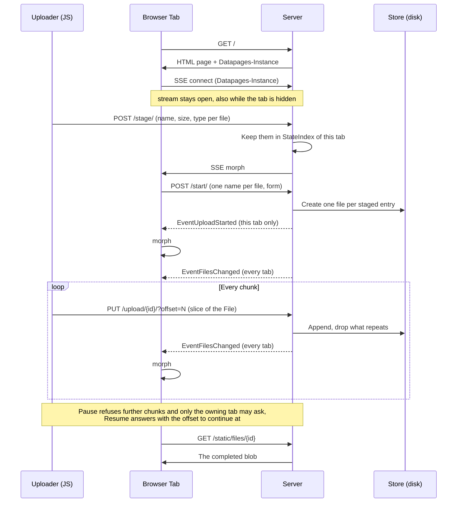

# File Upload

Upload files to disk and download them again. An upload is sent in chunks, can be paused and resumed, and survives a reload of the page or a restart of the server: the store knows how many bytes of each file arrived and the transfer continues there.

Files are kept in the `uploads` directory, one blob and one metadata file each. The page shows the absolute path they land in.

> [!NOTE]
> This demo has initially been a testbed for the AI skills
> and will gradually be improved and simplified.

## Prerequisites

- [Go](https://go.dev/dl/) 1.27+
- [Datapages](https://github.com/romshark/datapages) CLI (for `datapages watch`)

## Run

```sh
go run ./cmd/server
```

Then open http://localhost:8080/. `-dir` chooses another upload directory.

## Develop

```sh
datapages watch
```

Then open http://localhost:7331/.

## What it does

- **Upload** picks files, dropping them anywhere on the page does the same.
- A dialog opens on the picked files with an editable name per file, the original by default. Nothing is stored until it is confirmed.
- Picking a file that an unfinished upload is already missing bytes of offers to continue that one instead of starting a second.
- Every file shows its name, size, type, when it was added, a progress bar and the bytes that arrived, updated on every chunk in every open tab.
- The tab sending a file has **Pause** and **Resume** for it. Every other tab has **Take over**, which asks for the file and continues it from there. A finished file has **Download**. **Delete** removes the file and its bytes.
- **Upload limit** and **Download limit** in KiB/s, each with an **Unlimited** switch. Both are enforced by the server and take effect on transfers already running.

## Architecture

The server owns everything: which files exist, how many bytes of each arrived and whether one is expecting more. The browser holds the `File` objects and nothing else. The page is rendered from the store on every change.

### The one piece of JavaScript

`app/static/browser.js` holds every line of client-side logic in this example, and holds only what Datastar cannot reach: opening, slicing and streaming a `File`. Everything a visitor presses is a Datastar action, and every update the page shows was rendered in Go. The UI itself is [Morpheus](https://romshark.github.io/morpheus/), a web component kit built to survive being patched from the server.

The uploader learns what to do from the server. `dpUpload.start(jobs)` and `dpUpload.go(job)` arrive as scripts on the stream, each job carrying the URL of the chunk endpoint and the offset to continue at. That URL is cut out of the generated action expression in `app/uploadjob.go`, which keeps the route declared only in the doc comment of its handler.

The uploader never changes the state of a file. Pausing is the visitor pressing Pause, and nothing else: a chunk that fails is tried again with a growing delay, and a transfer this tab gives up on keeps its bytes and its place for whoever takes it up next. It sends at most three files at once. A browser opens only a handful of connections per origin, one of which the page stream holds for as long as the tab is open. Sending every picked file at once would leave none for that stream and none for the actions the page sends.

### The chunk endpoint

`PUTChunk` is the one handler a Datastar action does not call. Its body is the chunk, `?offset=` says where it belongs, and its status codes are the protocol the uploader follows:

| status | meaning | what the uploader does |
| --- | --- | --- |
| 200 | the bytes were appended | send the next chunk |
| 403 | the file is paused or complete | stop |
| 404 | the file is gone | forget it |
| 409 | the offset leaves a hole | stop, the transfer has to be taken up again |

A chunk that repeats bytes the store already has is accepted and its overlap dropped, which is what makes a retried request harmless. Anything else that fails, a lost connection or a proxy error, is retried a few times and then left alone.

A server times a whole request, and an upload held back by a limit outlives that: a megabyte at the lowest limit the page offers takes a quarter of an hour, and the transfer would die with `i/o timeout` halfway through. `ChunkDeadline` moves the read deadline forward while the bytes arrive, which turns the total into an idle deadline and still ends a connection that stopped sending.

### Who may pause and resume

Only the browser that read a `File` can go on reading it, which leaves one tab able to continue a given transfer. The store records which tab that is in `File.Owner`, a `stateID`, and the handlers refuse a pause or a resume from any other tab. `stateID` names the tab that is asking, and `fileList` renders **Pause** and **Resume** for that tab and **Take over** for the rest.

`GET` cannot read `stateID`, because a tab has no state until it connects its stream. It does not need to: a tab that just loaded holds no `File` and owns nothing, which is exactly what it renders.

`StreamClose` gives up what a tab was sending by clearing the owner, and leaves the status alone: a file the visitor did not pause is still one the server expects the rest of, only the sender is missing. A reload, a closed tab or a lost connection therefore leaves every unfinished upload owned by nobody, and every tab is offered **Take over**. This is why the uploader needs no `pagehide` handler.

An unfinished file carries a status icon, which only moves while somebody is sending the file. An upload nobody holds shows as interrupted, which `transferState` derives from the status and the owner; only what the visitor paused shows as paused. A complete file carries no icon: the row already offers a download rather than a transfer.

### Picking the same file again

An unfinished upload of the same original name and size is offered in the dialog as something to continue, at the offset it reached, with uploading a second file as the other choice. A complete file is not offered: there is nothing left of it to send, and picking it again uploads a second copy.

The choice stays with the visitor because a name and a size are all a browser reveals, and two different files can share both. Continuing the wrong one would append the bytes of one file to the prefix of another. `POSTStart` re-checks the match when the dialog is confirmed: an upload that completed or was deleted while the dialog stood open starts a new file instead.

The name a matching row offers is the one that upload already carries, which is why confirming the dialog unchanged renames nothing. `store.Create` counts a name up to `notes (2).txt` when another file already answers to it, which is what keeps two rows of the list apart.

### Resuming a file the browser lost

A reload drops the `File` objects but not the bytes on the server. **Take over** opens the file dialog, and `POSTReattach` checks the picked file against the name the browser reported and the announced size before the transfer continues at the received offset and the tab becomes its owner.

The dialog is opened by the button and nothing is sent before a file is picked: closing it leaves the upload exactly as it was.

Name and size are all a browser reveals before the bytes are read. An application that must not append the wrong bytes would keep a checksum of what arrived and have the client prove it.

### Speed limits

The browser holds one rate field and one **Unlimited** switch per direction and nothing else: no client sends itself slowly. Either control posts `POSTLimits`, which sets the two budgets in `App` and announces them, and every tab writes the values that took effect back into its controls.

Each budget is one `throttle.Limiter` shared by every transfer in that direction, which makes the limit a limit of the server and not one per visitor. Uploads are paced by reading the request body more slowly in `PUTChunk`: its buffers fill, TCP stops the sender, and a client that ignores the limit gains nothing. Downloads are paced by reading the blob more slowly in the handler, which is what `http.ServeContent` writes from.

Pacing makes one chunk take a long time, which shapes `store`. An entry has one lock for its metadata and another for the chunk being written, which keeps listing the files from waiting for a transfer. The received bytes are recorded as they arrive, which moves the progress bar during a chunk and ends a paused one within one write rather than at the end of the request.

The limits live in memory and start unlimited on every restart.

### Where each value lives

| value | where |
| --- | --- |
| Files, their bytes and their status | `store.Store`, on disk |
| Which tab is sending a file | `store.File.Owner`, in memory |
| The two transfer limits | `App`, one `throttle.Limiter` each |
| Files picked but not confirmed yet | `StateIndex`, per tab |
| Whether a drag is over the page | a Datastar signal |
| The `File` objects being sent | the uploader, per tab |

Which tab is sending a file is not per-tab state: two tabs must not send the same file, and no tab can decide that on its own.

`EventFilesChanged` and `EventLimitsChanged` carry nothing: every subscriber reads what it needs from the store or from `App`. `EventUploadStarted` carries the jobs of one tab and is addressed with `datapages.SubjectStateID`, since only that tab holds the files. It also carries the dialog away, because a handler that opens a stream cannot read the request body afterwards, and `POSTStart` reads the names from the dialog form.

### Downloads

A page renders a component and cannot write bytes, hence the blob of a completed file is served by middleware: `app/download.go` answers `/static/files/<id>` from the store and passes everything else to the router.

The route sits below the URL prefix the app declared for its assets, which lets the template build the link with `href.Asset("files/"+id)`. A URL written by hand would be rejected by `datapages lint`, and `href.External` warns about an app-internal one.

Serving the blobs through `datapages.WithAssetsFS` instead would work and needs no middleware, but the asset route is file serving and nothing else: it has no handler to check a session in, sets no `Content-Disposition`, and replaces the embedded serving of `WithAssets` including its dev-mode reads from disk. The handler here sets the type the browser reported on upload, names the file in the response and is where an authorization check would go.

Every uploaded file is readable by whoever knows its 128 bit identifier. This example authenticates nobody. An application with visitors would read the session in that handler and would limit what one visitor may store.

### Interaction flow


