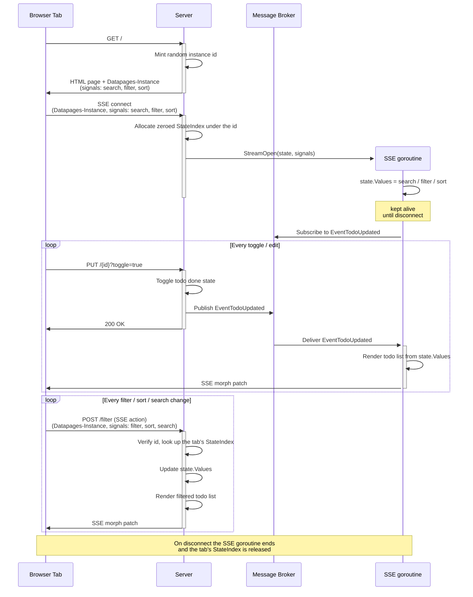

# Todo List

A collaborative real-time todo list demonstrating per-tab server-side state handling.
Changes made in one tab are immediately reflected in all other open tabs across all
connected clients. For simplicity reasons,
all data is stored in memory and lost on restart.

This example implements the official Datastar design recommendtations following
[The Tao of Datastar](https://data-star.dev/guide/the_tao_of_datastar).

https://github.com/user-attachments/assets/bac07de1-bce6-43fe-af32-41a10c2e0add

## Prerequisites

- [Go](https://go.dev/dl/) 1.27+
- [Datapages](https://github.com/romshark/datapages) CLI (for `datapages watch`)

## Run

```sh
go run ./cmd/server
```

Then open http://localhost:8080/.

## Develop

```sh
datapages watch
```

Then open http://localhost:7331/.

## Architecture

- Following the [CQRS](https://data-star.dev/guide/the_tao_of_datastar#cqrs)
  architecture, actions (commands) transmit user inputs to the server while UI
  updates are received via SSE. To reduce code complexity, the server sends the
  whole page template rerendered with new data
  (["fat morph"](https://data-star.dev/guide/the_tao_of_datastar#in-morph-we-trust)),
  which isn't a problem thanks to
  [Brotli compression](https://andersmurphy.com/2025/04/15/why-you-should-use-brotli-sse.html).
- Per-tab state lives in `StateIndex` and `StateItem` and is reached through
  the `datapages.State[T]` handler parameter. Datapages mints a random
  instance identifier per page load and sends it in the `Datapages-Instance` header.
  The server uses the identifier to pass each handler the calling tab's state.
  The state is allocated when the tab opens its SSE stream and
  released when that stream closes.
- All application state is managed by the server and stored on the server
  (see [State in the Right Place](https://data-star.dev/guide/the_tao_of_datastar#state-in-the-right-place)).
- For simplicity reasons, an in-memory message broker is used since this example
  doesn't require a multi-instance setup.
- Filter and sort state is synced to the URL via `reflectsignal` query parameters,
  so reloading the page preserves the current view.

### Interaction flow


