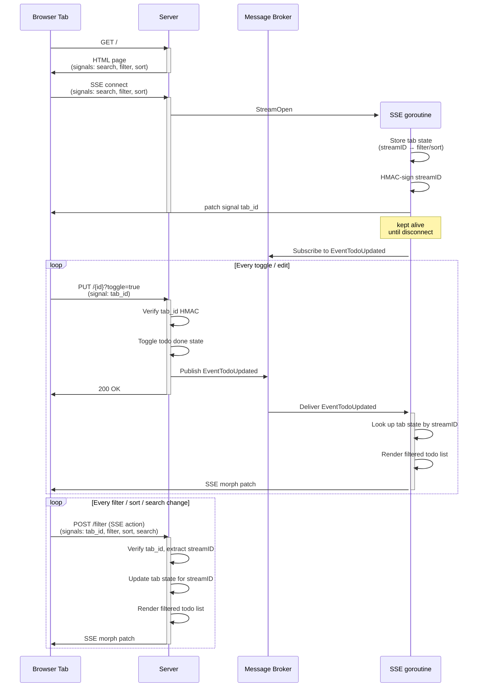

# Todo List

A collaborative real-time todo list demonstrating per-tab server-side state handling,
HMAC-signed tab identifiers, and the
[CQRS](https://data-star.dev/guide/the_tao_of_datastar#cqrs) &
[fat morphs](https://data-star.dev/guide/the_tao_of_datastar#in-morph-we-trust)
architecture.

Changes made in one tab are immediately reflected in all other open tabs.
All data is stored in memory and lost on restart.

## Prerequisites

- [Go](https://go.dev/dl/) 1.26+
- [Datapages](https://github.com/romshark/datapages) CLI (for `datapages watch`)

## Run

```sh
HMAC_SECRET_KEY=my-secret go run ./cmd/server
```

Then open http://localhost:8080/.

The `HMAC_SECRET_KEY` defaults to a dev-only value if unset.

## Develop

```sh
datapages watch
```

Then open http://localhost:7331/.

## Architecture

This example uses a [CQRS](https://data-star.dev/guide/the_tao_of_datastar#cqrs)
approach with
[fat morphs](https://data-star.dev/guide/the_tao_of_datastar#in-morph-we-trust).
Actions (commands) modify state and dispatch `EventTodoUpdated`.
Event handlers (queries) re-render the relevant page fragment via SSE.

- Toggling done is supported on both pages.
- All state lives on the server. No JavaScript.

Tab identity is established by HMAC-signing the `streamID` in `StreamOpen`
and patching the result to the client as a `tab_id` signal. Every action handler
verifies this signature, preventing one tab from impersonating another.

Editing and toggling are handled by a single shared App-level action
`PUTEdit /{id}`. When called with `?toggle=true` (from PageIndex checkboxes),
it flips the done state server-side. When called without (from PageItem inputs),
it updates all fields from signals. Both paths dispatch `EventTodoUpdated`.

Filter and sort state is synced to the URL via `reflectsignal` query parameters,
so reloading the page preserves the current view.

### Interaction flow


