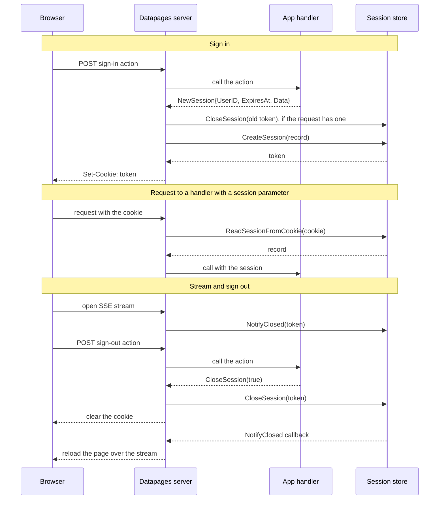

# Sessions

Package `sessions` declares the interfaces a session store implements and the `Record` it stores. Pass a store to `datapages.WithSessionManager`: `inmem` for development and tests, `natskv` for production, or any other `sessions.Manager`.

- A cookie that names no session is cleared, and the request continues as a guest. A store error answers 503 and keeps the cookie.
- A session past its `ExpiresAt` is closed when it is next read, and its streams stop at `ExpiresAt`. `DeleteExpired` removes the sessions nobody reads again. The server never calls it: the application schedules it.
- `UserSessions` and `CloseAllUserSessions` are optional. The application calls them on the store, for a settings page or a sign-out everywhere. Their tokens are the ones the cookies carry, which `Session.Token()` returns, except where the store documents otherwise.
- The `inmem` cookie is the token itself. The `natskv` cookie is the session's KV key encrypted with AES-128-GCM, which keeps the user ID from the client.
